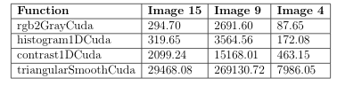
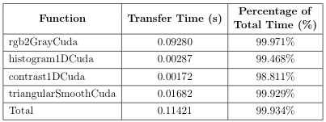

# Advanced Computing Systems - Lab 2 #

## Introduction to Image Processing ##

In this lab, CUDA was chosen as the programming environment to speed up the image processing pipeline. The task is to use a color image as an input, converts it to gray scale, create the image’s histogram and use it to improve the contrast of the gray scale image and finally create a smoothed gray scale version as the final version of the input image. Below are several task needed to be done to complete  the lab assignment.

- Converting a color image to grayscale
- Histogram computation
- Contrast enhancement
- Smoothing

### Results ### 

From table below, it can be concluded that the kernel speed up is succesfully achieved using CUDA library for various images as expected. The table shows that the highest speed up is achieved when triangularSmoothCuda function was performed on the largest image, image 9. TriangularSmoothCuda function run highly effective in GPU because of parallelism and GPU's faster floating point operation. And since image 9 has a very big size, a CUDA implementation improvement over CPU version will be even higher.

The table below shows that the amount of memory transfer time is very high. They occupy almost the total time of execution, almost above 99%. Unfortunately, this disadvantage is inevitable. Because of this reason, to ensure that the GPU implementation of such program is worthy, the domain problem should be large enough and the computation inside GPU should be complex enough, thus increasing its advantage over CPU implementation. 

### Conclusion ###

1. CUDA is a parallel programming library that utilizes NVIDIA GPU to do concurrent computation.
2. CUDA has various advantages as parallel programming library, such as :
  - It has Shared Memory which allocated per thread block and which can be accessed relatively fast.
  - CUDA has a method called `__syncthreads()` which can synchronize all threads execution
  		in a block. 
  - CUDA has plenty of useful tools to measure many kinds of parameter such as, throughput, maximum computation (in GFLOPS), memory usage, etc.
3. One of the disadvantage of CUDA is the memory transfer between GPU and CPU and device initialization. And in some application, it could be a bottleneck.  To ensure that the GPU implementation of such program is worthy, the domain problem should be large enough and the computation inside GPU should be complex, thus increasing its advantage over CPU implementation. 